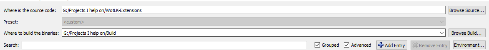
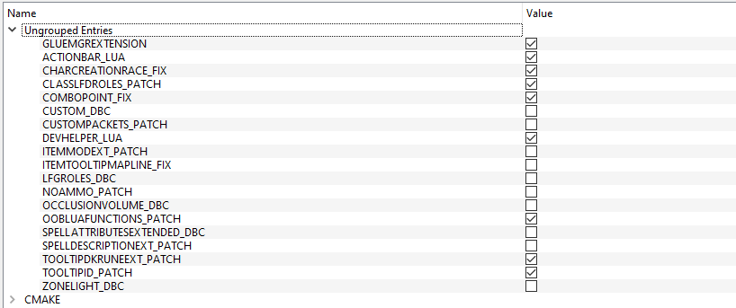
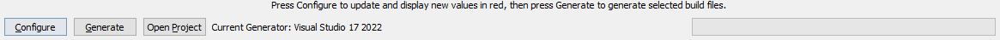
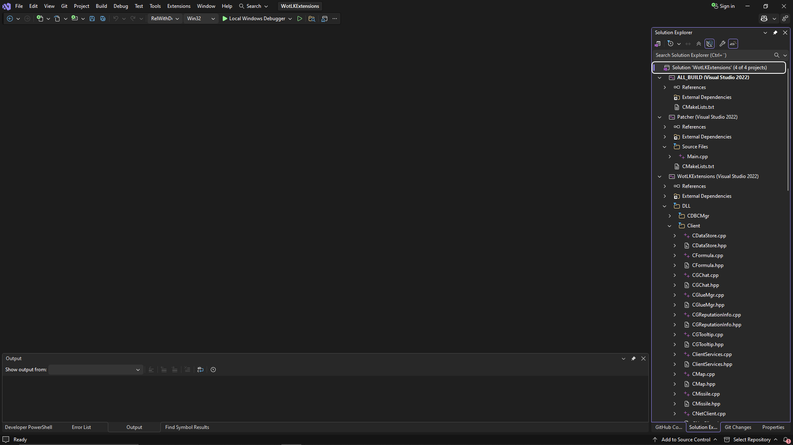
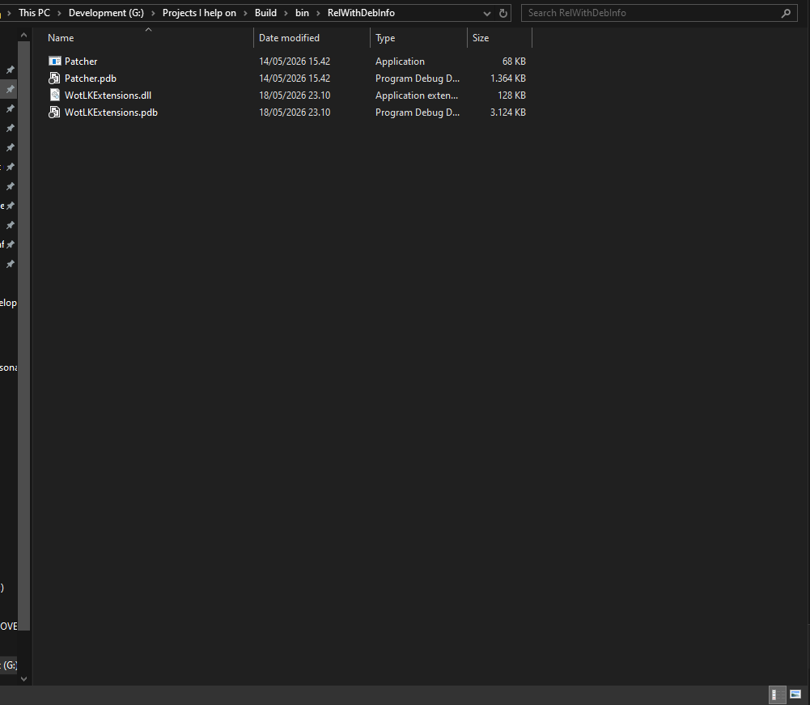
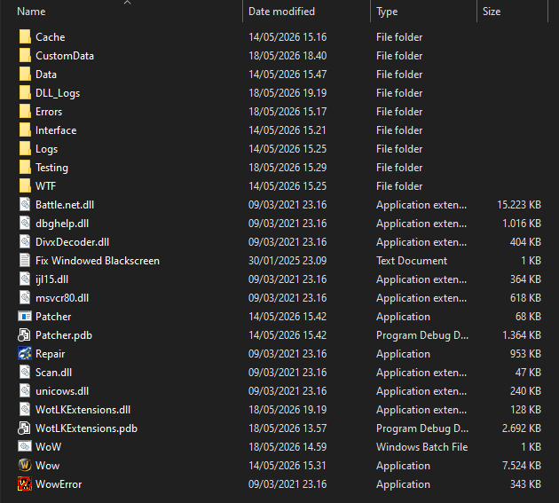

# Setup & Installation

This guide walks through the complete setup process for **WotLK Extensions**, from cloning the repository to patching your WoW 3.3.5a client and launching the extension framework.

---

## Prerequisites

Before building WotLK Extensions, make sure you have the following installed:

- **Git**
- **CMake** (latest stable version recommended)
- **Visual Studio 2022** (with C++ desktop development tools / latest Visual Studio version may also work)
- A **clean World of Warcraft 3.3.5a client**

!!! warning "Clean Client Required"
    The patcher **must be used on an unmodified `WoW.exe`**.  
    If your client has already been patched, modified, or altered by another tool, restore a clean executable before continuing.

---

## 1. Clone the Repository

Clone the repository using Git:

```bash title="Cloning the Repository" linenums="1"
git clone https://github.com/Alyst3r/WotLK-Extensions.git
cd WotLK-Extensions
```

---

## 2. Configure the Project with CMake

WotLK Extensions uses **CMake** to configure and generate the Visual Studio solution.

### Create a Build Directory

It is recommended to generate build files in a separate directory:

```bash title="Create Build Directory" linenums="1"
mkdir build
cd build
```

### Configure the Project

Open **CMake GUI** (or use the CLI) and configure the project with:

- **Source Directory** → your `WotLK-Extensions` repository
- **Build Directory** → your `build` folder

During configuration, CMake will expose the available **patch options**.

These options control which features are compiled into **`Patcher.exe`**, allowing you to decide which client modifications will be applied when patching `WoW.exe`.

!!! info "Patch Options"
    Image below shows an example of the CMake Source and Build directory configuration, the paths should match your local setup.



### Configure Patch Options

After setting the source and build directories, click **Configure**, if anything lights up red, please click **Configure** again. CMake will display a list of configurable options, including the available patches.

Review the available patch options and enable the features you want included in the patcher.

!!! info "Patch Selection"
    Only enable the patches you intend to use. These options are compiled into `Patcher.exe` during the build process.
    
    Below is an example of the patch options you may see in CMake:



---

## 3. Generate the Visual Studio Project

Once configuration is complete:

1. Click **Generate**
2. Let CMake create the Visual Studio solution/project files inside your build directory
3. After generation, if everything was successful, you should now be able to click **Open Project** in CMake to launch Visual Studio directly.

This will generate a standalone Visual Studio solution, typically inside, but it depends on your build directory configuration:

```text
WotLK-Extensions/build/
```



---

## 4. Open the Project in Visual Studio
!!! info "Open the Project"
    If you clicked **Open Project** in CMake after generation, Visual Studio should open automatically. You can skip this step.
After generation:

- Navigate to your build folder
- Open the generated Visual Studio solution (`.sln`)

Example:

```text
WotLK-Extensions/build/WotLKExtensions.sln
```



---

## 5. Build the Project

Inside Visual Studio:

1. Select your build configuration:
    - `Debug`
    - `RelWithDebInfo` *(recommended for development)*
2. Build the solution

Visual Studio will compile the project and output the required binaries.

---

## 6. Locate the Generated Files

After a successful build, the compiled files will be located inside:

```text
build/bin/<Debug|RelWithDebInfo>/
```

You should see:

- `Patcher.exe`
- `WotLKExtensions.dll`



---

## 7. Copy Files to Your WoW Client Folder

This step is **critical**.

Copy the following files:

- `Patcher.exe`
- `WotLKExtensions.dll`

Into your **World of Warcraft 3.3.5a client folder**, where `WoW.exe` is located.

Example:

```text
World of Warcraft/
├── WoW.exe
├── Patcher.exe
├── WotLKExtensions.dll
```

!!! danger "Important"
    `Patcher.exe` and `WotLKExtensions.dll` **must be placed inside the WoW client directory**, next to `WoW.exe`.

    Do **not** run the patcher from another folder.  
    Do **not** leave the DLL in your build output directory.  
    The files must live directly inside the client folder.



---

## 8. Patch the WoW Client

Inside your WoW 3.3.5a client folder:

1. Double-click **`Patcher.exe`**
2. Let it apply the selected patches to `WoW.exe`

!!! warning "Do Not Patch an Already Patched Client"
    `Patcher.exe` expects a **clean, original `WoW.exe`**.

    Running the patcher on an already patched executable may fail or produce unexpected behavior.

!!! info "Patching Process"
    If patching is successful, it should simply blink, if any errors occur, the patcher will display an error message.
    The patcher will modify `WoW.exe` in-place, applying the selected patches.  
    After patching, `WoW.exe` will be modified to automatically load `WotLKExtensions.dll` on startup.

---

## 9. Launch the Game

After patching is complete:

- Launch **`WoW.exe`** normally

If patching was successful:

- `WoW.exe` will automatically load and inject **`WotLKExtensions.dll`**
- The extension framework will initialize during startup

No manual DLL injector is required.

---

## Final Folder Layout

Your client folder should look similar to this:

```text
World of Warcraft/
├── WoW.exe
├── Patcher.exe
├── WotLKExtensions.dll
├── Data/
├── Interface/
└── ...
```

---

## Troubleshooting

### Patcher does not work

Check:

- Is `WoW.exe` clean and unmodified?
- Is `Patcher.exe` in the same folder as `WoW.exe`?
- Is `WotLKExtensions.dll` in the same folder as `WoW.exe`?

### DLL does not load

Check:

- Was patching successful?
- Is `WotLKExtensions.dll` still present in the WoW client folder?
- Are you launching the patched `WoW.exe`?

---

## Summary

Setup follows this workflow:

```text
Clone Repository
    ↓
Configure with CMake
    ↓
Enable Desired Patch Options
    ↓
Generate Visual Studio Project
    ↓
Build Solution
    ↓
Copy Patcher.exe + WotLKExtensions.dll to WoW Client Folder
    ↓
Run Patcher.exe
    ↓
Launch WoW.exe
    ↓
WotLK Extensions loads automatically
```